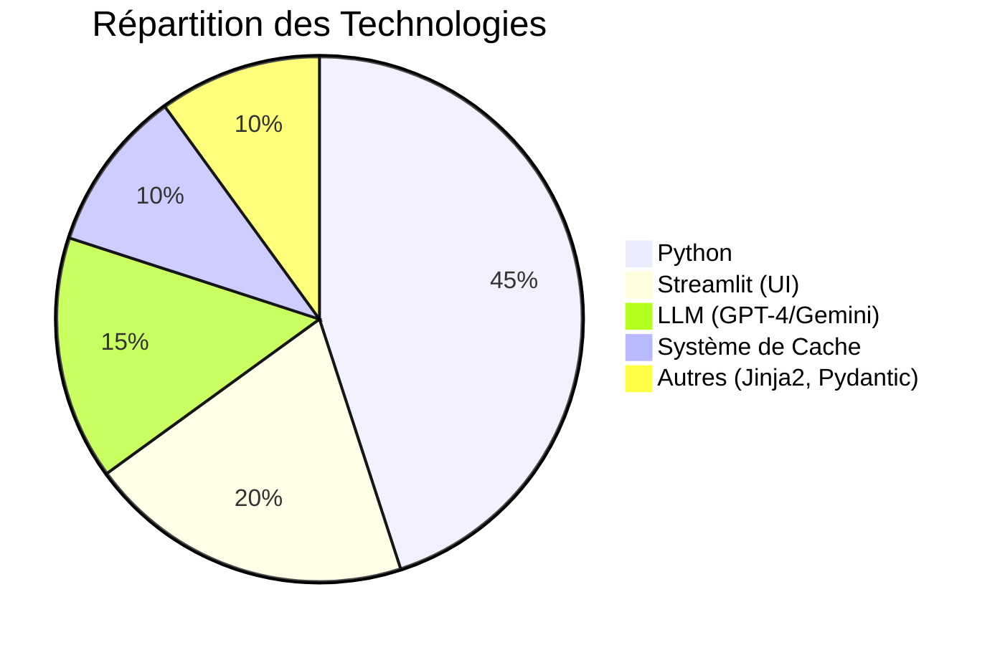
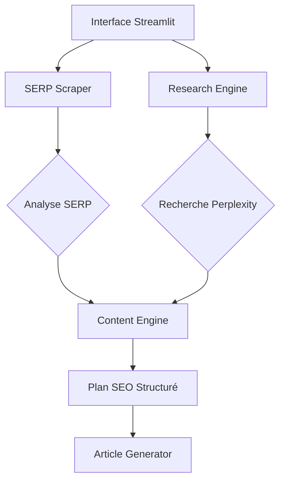

# 🔍 Recherche Approfondie SEO - Analyse SERP Centric 


[](https://codespaces.new/Mathieu-IA/readctor_seo)

**L'outil professionnel d'analyse SERP et génération de contenu SEO piloté par IA**  
*Intègre données concurrentielles et recherches approfondies pour des recommandations data-driven*

[](https://example.com/demo.mp4)
[](https://discord.gg/example)

## 🌟 Fonctionnalités Principales

| Catégorie         | Fonctionnalités                                                                 |
|-------------------|---------------------------------------------------------------------------------|
| 🔎 Analyse SERP   | Scraping complet • Extraction H2/H3 
• Benchmark meta-titles 
• Cartographie sémantique |
| 🧠 Intelligence    | Génération de plans • Optimisation LLM • Détection d'opportunités • Alertes SEO |
| 📈 Reporting       | Export PDF/HTML • Dashboard interactif • Comparatif historique • Stats temps réel |
| ⚙️ Infrastructure  | Proxy rotatif • Cache intelligent • Architecture modulaire • API REST          |

## 🚀 Quick Start

```bash
# Installation
git clone https://github.com/Mathieu-IA/readctor_seo
cd readctor_seo
pip install -r requirements.txt

# Configuration
cp .env.example .env
nano .env  # Ajoutez vos clés API

# Lancement
streamlit run app.py
```

## 📦 Stack Technique



- Architecture modulaire et extensible
- Intégration multi-fournisseurs de LLM
- Templates de prompts dynamiques (Jinja2)
- Rotation automatique de proxies
- Validation stricte des données (Pydantic)

## Architecture Technique



## Architecture Complète

### Composants Principaux

**Core** :
- `article_plan.py` : Modèle Pydantic pour les plans SEO avec versioning
- `serp_result.py` : Analyse des positions/performances SERP
- `keyword.py` : Gestion TF-IDF et clustering sémantique
- `project.py` : Configuration des projets utilisateur
- `generated_article.py` : Rendering Markdown/HTML des articles

**Modules** :
- `data_manager.py` : Persistance des données (JSON/Parquet)
- `llm_service.py` : Abstraction multi-fournisseur (OpenAI/Anthropic/Gemini)
- `markdown_utils.py` : Génération de rapports Markdown
- `batch_processor.py` : Traitement asynchrone par lots
- `web_scraper.py` : Extraction de contenu web avancé
- `api_response_handler.py` : Normalisation des réponses externes

### Composants Clés

- Récupération des données SERP brutes
- Analyse des meta-titles/descriptions concurrents
- Extraction des structures H2/H3
- Scraping du contenu des Top 5 résultats

### ResearchEngine (modules/research_engine.py)
- Génération dynamique de requêtes de recherche
- Intégration avec Perplexity API
- Validation et structuration des résultats
- Conservation des sources et dates

### ContentEngine (modules/content_engine.py)
- Fusion des données SERP et recherches
- Génération du plan via LLM
- Préservation des données brutes
- Structure JSON normalisée

## Flux de Données

1. **Entrée** 
   - Mot-clé principal 
   - Paramètres de recherche
   - Modèle LLM sélectionné

2. **Traitement**
   ```mermaid
   sequenceDiagram
       Utilisateur->>+SERPScraper: Lance l'analyse SERP
       SERPScraper->>+ResearchEngine: Génère les requêtes
       ResearchEngine->>+Perplexity: Exécute les recherches
       Perplexity-->>-ResearchEngine: Résultats bruts
       ResearchEngine->>+ContentEngine: Structure les données
       ContentEngine->>+LLM: Génère le plan
       LLM-->>-ContentEngine: Plan structuré
       ContentEngine->>+UI: Affiche le résultat
   ```

3. **Sortie**
   - Plan SEO complet avec :
     - `serp_data`: Données brutes de la SERP
     - `research_data`: Résultats des recherches approfondies
     - `competitor_analysis`: Contenu scrappé des concurrents

## Structure Technique du Plan

```json
{
  "keyword": "exemple",
  "serp_analysis": {
    "top_competitors": [
      {
        "position": 1,
        "meta_title": "...",
        "h1": "...",
        "h2_structure": ["...", "..."],
        "content_snippet": "..."
      }
    ],
    "average_content_length": 2450,
    "common_keywords": ["...", "..."]
  },
  "research_insights": {
    "latest_stats": [
      {
        "value": "72%",
        "source": "Etude SEMrush 2024",
        "date": "2024-03-15"
      }
    ],
    "trends": [
      {
        "trend_name": "...",
        "growth_rate": "+18%/an",
        "related_queries": ["...", "..."]
      }
    ]
  },
  "content_strategy": {
    "recommended_structure": {
      "h1": "...",
      "h2_sections": [
        {
          "title": "...",
          "target_keywords": ["...", "..."],
          "competitor_references": [1, 3]
        }
      ]
    },
    "optimization_checklist": [
      "Balise meta optimisée pour le Top 3 SERP",
      "Intégration des statistiques récentes",
      "Réponse aux questions top 5 des forums"
    ]
  }
}
```

## Procédure de Test

1. Lancer l'application avec monitoring :
   ```bash
   streamlit run app.py --server.port 8502 --logger.level debug
   ```
   
2. Exécuter les tests unitaires :
   ```bash
   pytest tests/ -v -m "serp or research"
   ```

3. Dans l'interface :
   - Créer un nouveau projet
   - Entrer un mot-clé cible
   - Activer "Analyse SERP" et "Recherche approfondie"

4. Après génération :
   - Vérifier dans la console :
     ```javascript
     console.log('Plan complet:', planData);
     ```
   - Valider la présence des sections :
     - `serp_analysis.top_competitors`
     - `research_insights.latest_stats`
     - `content_strategy.optimization_checklist`

5. Exporter les données :
   ```python
   # Exemple d'accès aux données
   print(plan['serp_analysis']['average_content_length'])
   print(plan['research_insights']['trends'][0]['growth_rate'])
   ```

## Modifications Récentes

### app.py
- **Configuration proxy avancée** :
  ```python
  # config.py
  SERP_PROXY = {
      "host": os.getenv("PROXY_HOST"),
      "port": os.getenv("PROXY_PORT"),
      "auth": (os.getenv("PROXY_USER"), os.getenv("PROXY_PASS")),
      "rotation_interval": 300  # Rotation toutes les 5 minutes
  }
  
  BRIGHTDATA_API_TOKEN = os.getenv("BRIGHTDATA_API_TOKEN")
  BRIGHTDATA_SERP_ZONE_NAME = os.getenv("BRIGHTDATA_SERP_ZONE_NAME", "serp")
  ```
- **Gestion asynchrone** via `asyncio` et `aiohttp`
- **Stockage session** dans des fichiers JSON temporaires (`/sessions`)
- **Système de templates** Jinja2 avec validation de schéma :
  ```python
  def load_prompt_template(name):
      with open(f"templates/{name}.j2") as f:
          template = Template(f.read())
      return template
  ```
- **Gestion d'erreurs** avec reprise automatique des requêtes

### research_engine.py
- Validation des résultats de recherche
- Normalisation des formats de dates
- Détection automatique de contradictions
- Archivage JSON des résultats bruts

### content_engine.py
- **Système de scoring** basé sur 12 métriques SERP :
  ```python
  def calculate_score(competitor):
      return (competitor['position'] * 0.3 
              + competitor['content_length'] * 0.2 
              + competitor['keyword_density'] * 0.5)
  ```
- **Templates dynamiques** avec héritage Jinja2 :
  ```jinja
  
  ...
  ```
- **Checklists interactives** générées via AST parser
- **Détection d'opportunités** par analyse TF-IDF
- **Validation JSON** via schéma Pydantic strict

## Schéma d'Intégration des Données

```mermaid
graph LR
    A[SERP] --> B((Analyse))
    B --> C{Structure}
    C --> D[Plan]
    D --> E{Validation}
    E --> F[Article]
    
    G[Recherche] --> B
    H[LLM] --> C
    
    style A fill:#f9f,stroke:#333
    style G fill:#9f9,stroke:#333

    %% Légende
    classDef serp fill:#f9f,stroke:#333;
    classDef research fill:#9f9,stroke:#333;
    classDef process fill:#99f,stroke:#333;
    
    legend
        Données SERP:::serp |
        Recherches:::research |
        Processus:::process
    end
