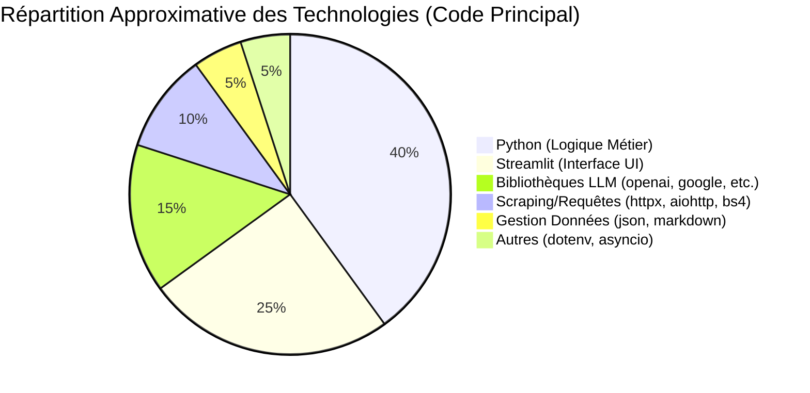
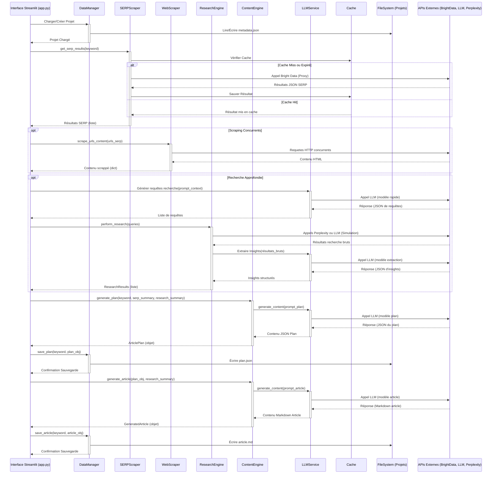

# 🚀 SEO Content Generator Pro - Rédacteur SEO IA

 
 

[](https://codespaces.new/Mathieu-IA/readctor_seo) 

**L'outil Streamlit pour l'analyse SERP, la recherche IA et la génération de contenu SEO (Plans & Articles)**
*Générez des plans d'articles structurés et des rédactions complètes basés sur les données SERP, le contenu des concurrents et des recherches IA optionnelles.*

## 🌟 Fonctionnalités Réellement Implémentées

| Catégorie                | Fonctionnalités                                                                                                                                 |
| :----------------------- | :---------------------------------------------------------------------------------------------------------------------------------------------- |
| 🗂️ **Gestion Projet** | • Organisation par Projets et Mots-Clés.<br> • Sauvegarde/Chargement des plans (JSON) et articles (Markdown).                                      |
| 🔍 **Analyse SERP** | • Récupération des résultats Google SERP via Bright Data (Proxy `brd_json=1`).<br> • Mise en cache des résultats SERP.<br> • Scraping du contenu texte des Top URLs de la SERP. |
| 🧠 **Recherche IA** | • Génération dynamique de requêtes de recherche basées sur le mot-clé/SERP.<br> • Intégration Perplexity API (si clé fournie) ou Simulation LLM.<br> • Extraction d'insights structurés à partir des résultats de recherche. |
| ✍️ **Génération Contenu** | • Génération de Plans d'articles structurés (JSON) via LLM, intégrant SERP/Recherche.<br> • Rédaction d'Articles (Markdown) basée sur le plan et la recherche.<br> • Support multi-LLM (OpenAI, Anthropic, Google, DeepSeek). |
| ✨ **Fonctions Add.** | • Traitement par Lots Asynchrone (Plans/Articles) avec suivi de progression.<br> • Génération d'images d'illustration via Google Gemini.<br> • Export des plans/articles (JSON, MD, HTML, DOCX, WordPress HTML). |
| 🖥️ **Interface & Infra.** | • Interface utilisateur basée sur Streamlit avec onglets.<br> • Configuration via fichier `.env`.<br> • Architecture modulaire (Core / Modules).                               |

## 🚀 Démarrage Rapide

# 1. Cloner le dépôt (si disponible)
```bash
# git clone [https://github.com/VOTRE_USER/readctor_seo](https://github.com/VOTRE_USER/readctor_seo) 
# cd readctor_seo
```

# 2. Installer les dépendances
pip install -r requirements.txt

# 3. Configurer les clés API
cp .env.example .env  # Créez votre fichier .env s'il n'existe pas
nano .env          # Ajoutez vos clés API (OpenAI, Google, BrightData, etc.)

# 4. Lancer l'application Streamlit
streamlit run app.py

## 📦 Stack Technique Principale



- **Langage:** Python 3.10+
- **Interface Utilisateur:** Streamlit
- **LLMs:** Intégration via bibliothèques `openai`, `anthropic`, `google-generativeai` (+ `requests`/`httpx` pour DeepSeek/Perplexity)
- **Appels Asynchrones:** `asyncio`, `httpx`, `aiohttp`
- **Scraping SERP:** `aiohttp` (pour Bright Data via proxy), `beautifulsoup4` & `lxml` (pour contenu concurrent)
- **Gestion Données:** Modules `json`, `pathlib`, `shutil`. Stockage simple (JSON pour plans/metadata, MD pour articles).
- **Gestion Dépendances:** `pip` et `requirements.txt`
- **Configuration:** `python-dotenv`

## Architecture Simplifiée

```mermaid
graph TD
    subgraph "Interface Utilisateur (app.py)"
        A[UI Streamlit]
    end

    subgraph "Logique Métier (Modules)"
        B[DataManager]
        C[LLMService]
        D[ContentEngine]
        E[SERPScraper]
        F[ResearchEngine]
        G[WebScraper]
        H[BatchProcessor]
        I[MarkdownUtils]
    end

    subgraph "Coeur Applicatif (Core)"
        J[Project]
        K[Keyword]
        L[ArticlePlan]
        M[GeneratedArticle]
        N[SERPResult]
    end

    subgraph "Services Externes"
        O[API LLMs]
        P[Bright Data / Google SERP]
        Q[Perplexity API]
        R[Sites Web Concurrents]
    end

    subgraph "Système de Fichiers"
        S[Cache SERP]
        T[Dossiers Projet/Mot-Clé]
    end

    A -->|Gère Projets/Mots-clés| B
    A -->|Déclenche Génération| D
    A -->|Déclenche Traitement Lots| H
    A -->|Utilise Utilitaires MD| I

    D -->|Utilise LLM| C
    D -->|Appelle Analyse SERP| E
    D -->|Appelle Recherche| F
    D -->|Sauvegarde/Charge via| B

    F -->|Utilise LLM| C
    F -->|Appelle API Perplexity| Q

    E -->|Récupère SERP via| P
    E -->|Lit/Écrit Cache| S

    G -->|Scrape Sites| R

    H -->|Exécute Tâches Plan ou Article| D  // Ligne Corrigée

    B -->|Lit/Écrit Projets| T

    C -->|Appelle API LLMs| O

    B -.-> J & K
    D -.-> L & M & N
    E -.-> N

    style S fill:#f9f,stroke:#333
    style T fill:#f9f,stroke:#333
```

## Description des Composants

**Core (`core/`)**:
- `project.py`: Représente un projet SEO, gère les métadonnées du projet.
- `keyword.py`: Représente un mot-clé spécifique dans un projet, gère les chemins vers le plan et l'article.
- `article_plan.py`: Représente le plan d'article structuré (chargé/sauvé en JSON).
- `generated_article.py`: Représente le contenu de l'article généré (chargé/sauvé en Markdown).
- `serp_result.py`: Représente les données SERP mises en cache pour une requête.

**Modules (`modules/`)**:
- `data_manager.py`: Gère le chargement et la sauvegarde des projets, mots-clés, plans et articles sur le système de fichiers.
- `llm_service.py`: Fournit une interface unifiée pour interagir avec différents fournisseurs LLM (OpenAI, Anthropic, Google, DeepSeek) et pour la génération d'images (Google). Gère les clés API.
- `serp_scraper.py`: Récupère les résultats de recherche Google en utilisant l'API Bright Data (via proxy `brd_json=1`) et gère la mise en cache.
- `web_scraper.py`: Scrape et extrait le contenu textuel principal des URLs fournies (concurrents SERP).
- `research_engine.py`: Orchestre la recherche approfondie en générant dynamiquement des requêtes, en interrogeant Perplexity API (ou simulation LLM) et en structurant les résultats.
- `content_engine.py`: Génère les plans d'articles (JSON) et les articles (Markdown) en utilisant `LLMService` et en intégrant les données SERP, le contenu concurrent et la recherche.
- `batch_processor.py`: Gère l'exécution asynchrone de tâches (génération de plans/articles) pour plusieurs mots-clés, avec gestion de la concurrence, progression, pause/reprise/arrêt.
- `markdown_utils.py`: Fonctions utilitaires pour convertir le Markdown en HTML, DOCX, et format compatible WordPress. Convertit également les plans JSON en Markdown pour affichage.
- `api_response_handler.py`: (Utilisation limitée observée) Vise à standardiser les réponses des API.
- `config.py`: Charge et fournit les paramètres de configuration depuis les variables d'environnement / fichier `.env`.

## Flux Principal (Génération Plan -> Article)

1.  **Entrée Utilisateur (via `app.py`)**:
    * Sélection/Création d'un `Project`.
    * Entrée/Sélection d'un `Keyword`.
    * Choix des options (Analyse SERP, Recherche Approfondie).
    * Sélection des modèles LLM.

2.  **Analyse SERP (si activée)**:
    * `app.py` appelle `SERPScraper.get_serp_results(keyword)`.
    * `SERPScraper` vérifie le cache (`SERPResult`). Si absent/expiré, appelle Bright Data via proxy (`aiohttp`), récupère les résultats JSON (`brd_json=1`).
    * Standardise les résultats organiques (`rank`, `url`, `meta_title`, `meta_description`, `domain`).
    * Sauvegarde dans le cache (`SERPResult.save()`).
    * Retourne les résultats standardisés à `app.py`.

3.  **Scraping Concurrents (si SERP réussie)**:
    * `app.py` extrait les URLs du Top N des résultats SERP.
    * `app.py` appelle `WebScraper.scrape_urls_content(urls)`.
    * `WebScraper` récupère le contenu HTML (`httpx`), extrait le texte principal (`BeautifulSoup4`), et retourne un dictionnaire `url: contenu`.

4.  **Recherche Approfondie (si activée)**:
    * `app.py` génère des requêtes de recherche dynamiques via `LLMService` basé sur mot-clé/SERP/concurrents.
    * `app.py` appelle `ResearchEngine.perform_research(queries, model_settings)`.
    * `ResearchEngine` appelle Perplexity API (`openai` SDK si configuré) ou simule avec `LLMService`.
    * Extrait les insights via `LLMService`.
    * Retourne une liste d'objets `ResearchResult` à `app.py`.

5.  **Génération du Plan**:
    * `app.py` appelle `ContentEngine.generate_plan(...)` avec le mot-clé, les résumés SERP/concurrents/recherche, et les paramètres LLM.
    * `ContentEngine` formate un prompt spécifique et appelle `LLMService.generate_content()`.
    * `ContentEngine` parse la réponse JSON du LLM et crée un objet `ArticlePlan`.
    * `app.py` sauvegarde le plan via `DataManager.save_plan()`.

6.  **Génération de l'Article**:
    * L'utilisateur navigue vers l'onglet Rédacteur.
    * `app.py` charge le `ArticlePlan` via `DataManager.load_plan()`.
    * L'utilisateur configure les paramètres de rédaction (ton, longueur) et le modèle LLM.
    * `app.py` appelle `ContentEngine.generate_article(...)` avec l'objet `ArticlePlan`, le résumé de la recherche (si dispo), et les paramètres LLM.
    * `ContentEngine` formate le prompt et appelle `LLMService.generate_content()`.
    * `ContentEngine` crée un objet `GeneratedArticle`.
    * `app.py` sauvegarde l'article via `DataManager.save_article()`.

7.  **Sortie/Affichage (via `app.py`)**:
    * Affichage du plan (Markdown/JSON) et de l'article (Markdown/HTML).
    * Options d'édition et d'export (MD, HTML, DOCX, WP).



## Structure du Plan Généré (JSON)

Basé sur l'analyse des prompts et des exemples de plans (`coder_avec_Cline/plan.json`, etc.):

```json
{
  "keyword": "string - Le mot-clé ciblé",
  "metatitle": "string - Suggestion de méta-titre optimisé",
  "metadescription": "string - Suggestion de méta-description engageante",
  "h1": "string - Suggestion de titre H1 principal",
  "backstory": "string - Contexte/objectif de l'article basé sur l'analyse",
  "data": {
    "secondary_keywords": ["string"], // Liste de mots-clés secondaires pertinents
    "key_insights": ["string"]      // Liste des points/faits clés issus de l'analyse/recherche
  },
  "plan": [ // Liste des sections principales de l'article
    {
      "h2": "string - Titre de la section H2",
      "h3": ["string"], // Liste optionnelle de sous-titres H3
      "brief": "string - Instructions/points clés à couvrir dans cette section, basés sur l'analyse"
    }
    // ... autres sections H2 ...
  ]
}
```

## Procédure de Test (Basée sur l'UI)

1.  **Lancement:**
    * Assurez-vous que les clés API sont dans `.env`.
    * Lancez `streamlit run app.py`.

2.  **Gestion Projet:**
    * Créez un nouveau projet.
    * Sélectionnez le projet créé.

3.  **Génération Plan:**
    * Allez à l'onglet "Générateur de Plan".
    * Entrez un mot-clé (ex: "marketing de contenu IA").
    * Cochez "Analyse SERP Google".
    * Cochez "Activer la recherche approfondie" (si Perplexity ou LLM configuré).
    * Sélectionnez un modèle LLM pour le plan.
    * Cliquez sur "🚀 Générer le Plan".
    * **Vérification:**
        * Attendez la fin du spinner.
        * Vérifiez les messages de succès/erreur pour SERP et Recherche.
        * Le plan JSON doit s'afficher dans l'éditeur.
        * Les onglets "SERP" et "Recherche" doivent contenir des données (si activé).
        * Vérifiez que le fichier `plan.json` a été créé dans `projects/NOM_PROJET/keywords/NOM_MOTCLE/`.

4.  **Génération Article:**
    * Allez à l'onglet "Rédacteur d'Articles".
    * Vérifiez que le plan précédent est chargé (infos dans l'expander).
    * Sélectionnez un modèle LLM pour l'article.
    * Cliquez sur "✍️ Rédiger l'Article".
    * **Vérification:**
        * Attendez la fin du spinner.
        * L'article Markdown doit s'afficher dans l'éditeur.
        * Vérifiez que le fichier `article.md` a été créé dans le dossier du mot-clé.

5.  **Génération Image (si Google API configuré):**
    * Allez à l'onglet "Raffineur de Contenu".
    * Allez au sous-onglet "Éléments Visuels".
    * Cliquez sur "Générer Illustrations".
    * **Vérification:**
        * Attendez la fin du spinner.
        * Des images et leur code Markdown doivent s'afficher.

6.  **Traitement par Lots:**
    * Allez à l'onglet "Traitement par Lots".
    * Entrez plusieurs mots-clés manuellement.
    * Sélectionnez "Générer Plan" et/ou "Générer Article".
    * Configurez les modèles LLM pour le batch.
    * Cliquez sur "🚀 Démarrer le Traitement".
    * **Vérification:**
        * La barre de progression doit s'afficher.
        * Vérifiez les logs et les résultats détaillés dans l'expander.
        * Vérifiez la création des fichiers `plan.json`/`article.md` pour les mots-clés traités.
        * Testez les boutons Pause/Reprendre/Arrêter.

7.  **Exports:**
    * Testez les différents boutons d'export (JSON, MD, HTML, DOCX, WP) pour le plan et l'article.

```

Ce README est généré en analysant la structure du code, les imports, les classes, les fonctions et les interactions observées dans `app.py` et les différents modules. Il évite d'inclure des fonctionnalités mentionnées dans votre exemple mais non trouvées dans le code fourni (comme le scoring SERP, TF-IDF, Parquet, Pydantic, Jinja2, etc.).
